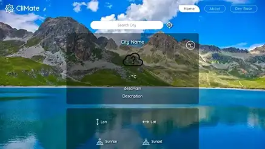

##### Created : 09/04/2023

# Kaito Daniel | BlockChain & Fullstack Web Developer
Welcome to Daniel Kaito's portfolio website, your gateway to the dynamic world of full stack web development. Immerse yourself in the digital realm where my expertise in coding and design converges to create extraordinary online experiences.

### Preview

## Tools and TechStacks used :

      
      
      
      
      

### Live Demo

Check out a live demo of ARMS at https://tigercoder0218.web.app/.

### LightHouse Audit

